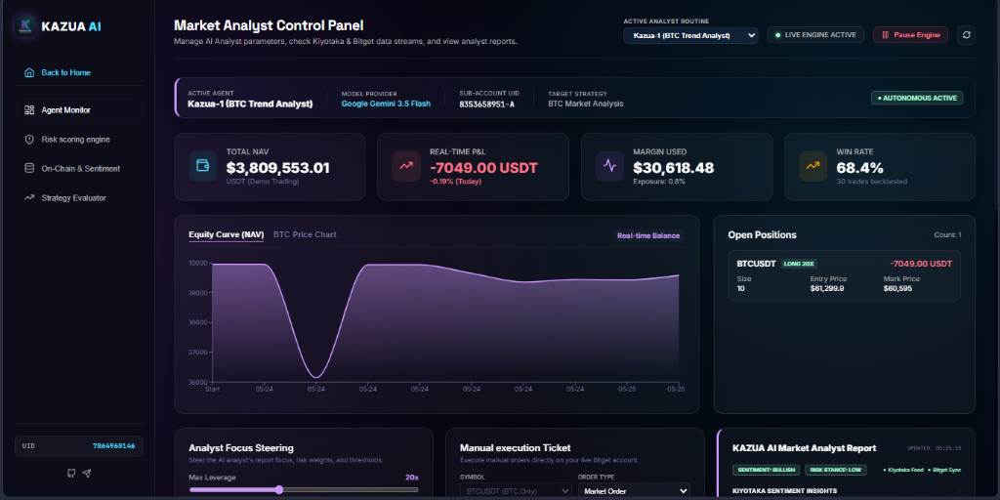
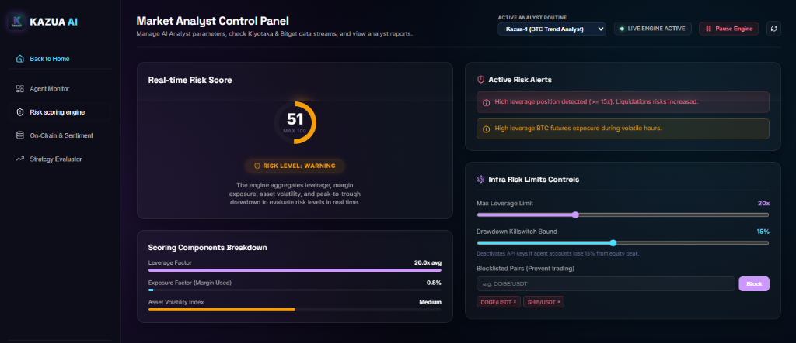
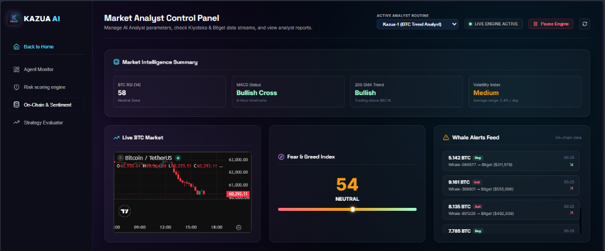
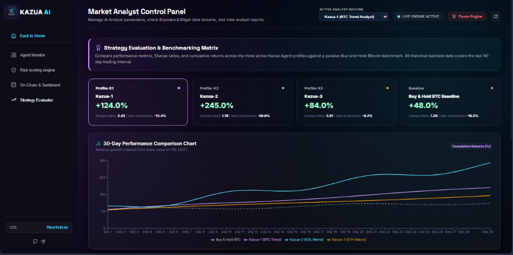
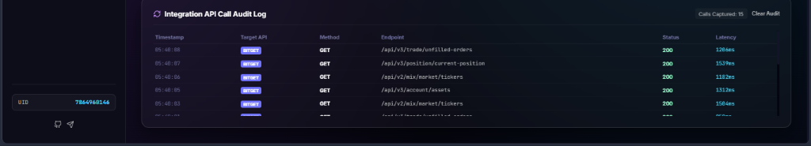

# <p align="center"><br />Kazua AI - Market Analyst & On-Chain Risk Dashboard</p>

---

**Kazua** is a premium, real-time dashboard built for traders to view AI-generated market analyst reports, evaluate portfolio risk, and visualize cross-exchange on-chain intelligence. 

The system integrates directly with **Google Gemini 3.5 Flash** to generate dynamic market analysis reports, the **Bitget API** for live exchange accounts and position tracking, and the **Kiyotaka Data API** for on-chain sentiment and liquidation flows.

---

## 💡 Core Thesis & Logic

Modern trading environments benefit greatly from real-time AI analysis. However, traders and risk managers often face three critical operational gaps:
1. **Lack of Synthesized Intel**: Hard to compile and visualize live account positioning alongside complex on-chain sentiments.
2. **Silent Liquidations**: Lack of real-time monitoring of live margin exposure, leverage limits, and real-time risk scoring.
3. **Information Silos**: Difficulty correlating live exchange position states with macro sentiment indicators and whale liquidations.

**Kazua** solves these challenges by providing a unified **Market Analyst & Risk Dashboard** divided into four main areas:
* **Agent Monitor**: Integrates with Bitget Account and Positions APIs to stream actual open positions, margins, and trades. It connects directly to the **Gemini API** to ingest this data alongside Kiyotaka on-chain metrics, producing real-time **AI Analyst Reports** (Sentiment, Risk Stance, specific Kiyotaka/Bitget insights, and Strategic Recommendations). Includes a CSV log exporter for manual trade auditing.
* **Risk Scoring Engine**: Computes a real-time risk rating (0–100) based on leverage, account exposure, and market volatility. Includes simulated safety controls (leverage limits, drawdown killswitches) to demonstrate active risk containment.
* **On-Chain & Sentiment Intel**: Queries the Kiyotaka Data API to aggregate weekly institutional ETF flows, perpetual funding rates, and Binance exchange liquidation events.
* **Strategy Evaluator**: Backtests and simulates quantitative agent returns under different market regimes (Bull, Bear, Range, Volatile).

---

## 🛠️ Architecture Overview

```
                                 ┌────────────────────────────────┐
                                 │         Kazua React App        │
                                 └───────────────┬────────────────┘
                                                 │
      ┌──────────────────────────────────────────┼──────────────────────────────────────────┐
      ▼                                          ▼                                          ▼
┌───────────────┐                          ┌───────────────┐                          ┌───────────────┐
│  Gemini API   │                          │  Bitget Proxy │                          │ Kiyotaka Proxy│
│(Dynamic Logic)│                          │ (/api/bitget) │                          │(/api/kiyotaka)│
└───────────────┘                          └───────┬───────┘                          └───────┬───────┘
                                                   ▼                                          ▼
                                           ┌───────────────┐                          ┌───────────────┐
                                           │  Exchange API │                          │ Kiyotaka API  │
                                           │(Account/Pos)  │                          │(Funding, Liqs)│
                                           └───────────────┘                          └───────────────┘
```

1. **AI Analyst Loop (Google Gemini 3.5 Flash)**: Every 15 seconds (configurable), the app packages the current prices, open positions, balance, Fear & Greed levels, and whale transfers from Kiyotaka and Bitget into a structured prompt, sends it to the Gemini API, and updates the Market Analyst Report panel and logging terminal (e.g., `🤖 Kazua AI [Analyst]: BTC consolidates at $65,420 with bullish indications.`).
2. **Vite Reverse Proxy Routing (`vite.config.js`)**: Configures server proxies for `/api/bitget` and `/api/kiyotaka` to bypass browser CORS preflight blocks during local development.
3. **Browser-Native Signing (`src/services/bitgetService.js`)**: Uses the standard browser **Web Crypto API** (`crypto.subtle`) to generate secure HMAC-SHA256 Base64 signatures for private Bitget requests on the client side.
4. **Hybrid Simulation & Live Syncing**: Ticks prices and P&L at high frequency (3s) in memory for smooth animations, while syncing with actual Bitget positions and account balances at low frequency (6s) to feed subsequent analyst loops.

---

## ⚙️ Setup & Environment Variables

Create a `.env` file in the root of the project directory:
```env
# Google Gemini API key
VITE_GEMINI_API_KEY=your_gemini_api_key

# Kiyotaka Data API key
VITE_KIYOTAKA_API_KEY=your_kiyotaka_api_key

# Bitget API credentials (spot/futures read permissions)
VITE_BITGET_API_KEY=your_bitget_api_key
VITE_BITGET_SECRET_KEY=your_bitget_secret_key
VITE_BITGET_PASSPHRASE=your_bitget_passphrase
```

---

## 🚀 Installation & Running

### Prerequisites
- Node.js (v18+)
- npm or yarn

### Steps
1. **Clone the Repository**:
   ```bash
   cd kazua
   ```
2. **Install Dependencies**:
   ```bash
   npm install
   ```
3. **Start the Development Server**:
   ```bash
   npm run dev
   ```
   *The application will start, typically at `http://localhost:5173/`.*

4. **Build Production Bundle**:
   ```bash
   npm run build
   ```

---

## 🖥️ How to Use the Dashboard

### 1. Navigating the Landing Page
- When you load the application, you will be greeted by the premium dark-themed landing page showcasing the **Kazua Analyst Suite** (Kazua-1, Kazua-2, Kazua-3).
- Click **Launch Portal** or **Launch Control Panel** to bypass the landing page and open the Market Analyst Control Panel.

### 2. Monitoring AI Analyst Routines
- In the top-right header, select which analyst routine to monitor using the **Active Analyst Routine** dropdown:
  - **Kazua-1 (BTC Trend Analyst)**: Scans MACD crossovers and order book depth to generate trend strength reports.
  - **Kazua-2 (BTC Volatility Analyst)**: Harvests Kiyotaka whale alerts and liquidations to detect volatility surges.
  - **Kazua-3 (BTC Macro Analyst)**: Ingests macro feeds and funding rate details to evaluate arbitrage basis-spreads.
- Turn the simulator on or off using the **Pause Engine / Resume Engine** button. You can also force a manual update tick by clicking the refresh icon next to it.

### 3. Using the Modules
- **Agent Monitor Tab**:
  - Displays real-time balance metrics, margin utilization, and risk indicators.
  - Shows live and simulated **Open Positions** (Asset, Size, Entry, Mark, Margin, Leverage, Unrealized P&L).
  - Contains the **KAZUA AI Market Analyst Report Card**: Ingests Kiyotaka + Bitget data to output a comprehensive analysis report, sentiment level, risk stance, and strategic recommendation.
  - Displays the **Trade Execution Log** which allows you to download a standardized CSV spreadsheet of all trades using the **Export CSV** button.
- **Risk Scoring Engine Tab**:
  - Displays a dynamic risk score dial (Green: low, Yellow: moderate, Red: critical).
  - Includes **Leverage Limits** and **Drawdown Killswitch** inputs where you can adjust thresholds. Activating a killswitch immediately triggers protective simulation routines.
- **On-Chain & Sentiment Intel Tab**:
  - Displays weekly ETF net flows (in USD).
  - Displays funding rate spreads across major perpetual exchanges.
  - Logs recent whale transfer activities and liquidations.
- **Strategy Evaluator Tab**:
  - Lets you backtest and run historical scenario returns under bull/bear/range markets.

### 📊 Verification & Audits
- **Exporting Trade Logs**: Go to the **Agent Monitor** tab, look at the **Trade Execution Log**, and click **Export CSV** to download a spreadsheet matching standard audit and submission requirements.
- **API Call Audit Log**: Scroll to the bottom of the dashboard to view the **Integration API Call Audit Log** detailing latency, endpoints, status codes, and HTTP methods for outbound queries to Bitget and Gemini.

---

## 📸 Proof of Concept & Usage Screenshots

Here are visual examples of the running application, serving as usage proof:

### 1. Market Analyst Dashboard (Agent Monitor Tab)
Displays real-time portfolio metrics, active futures positions, and the live **KAZUA AI Market Analyst Report** ingesting data from Bitget and Kiyotaka.


### 2. Risk Scoring Engine Tab
Computes real-time risk metrics and allows operators to adjust leverage limit parameters and trigger drawdown safety killswitches.


### 3. On-Chain & Sentiment Tab
Streams Fear & Greed levels, weekly institutional ETF flows, and Binance liquidation events via the Kiyotaka API.


### 4. Strategy Evaluator Tab
Compares cumulative returns and Sharpe ratios for the three active analyst sub-routines (K1, K2, K3) against a baseline hold strategy.


### 5. Integration API Call Audit Log
Audits outbound API requests to Bitget and Gemini endpoints, logging latency, response statuses, and parameters.


---

## 💡 Detailed Step-by-Step Usage Examples

Follow these examples to verify the core capabilities of the Market Analyst platform:

### Example 1: Steer the AI Analyst Focus
1. Launch the dashboard portal and go to the **Agent Monitor** tab.
2. In the **Analyst Focus Steering** card, adjust the **Risk Stop Tolerance** slider to `12%` and the **Analyst Risk Sensitivity** to `75%`.
3. Select **Conservative** under the *Analysis Stance* dropdown.
4. Click **Refresh Analyst Report**. The Gemini analyst report card will regenerate, showing text tailored to a conservative risk stance and high risk sensitivity.

### Example 2: Triggering Manual Market Analysis
1. Navigate to the **Agent Monitor** tab.
2. Scroll to the **KAZUA AI Market Analyst Report** card.
3. Click the **Refresh Analyst Report** button at the bottom of the card.
4. An event will be logged in the terminal: `🤖 Kazua AI: Manually triggering market analyst query...`
5. The report card will refresh its *Updated* timestamp and show the latest live analysis fetched from Gemini.

### Example 3: Simulating a Risk Alert
1. Navigate to the **Risk scoring engine** tab.
2. Notice the current *Real-time Risk Score* (e.g. `51` - Risk Level: Warning) and the *Active Risk Alerts* checklist showing warnings about high leverage exposure.
3. Lower the **Max Leverage Limit** slider in the *Infra Risk Limits Controls* card.
4. Stage a manual order on the execution ticket with high leverage (e.g., `20x`), and observe how the risk scoring circle shifts and triggers warning badges dynamically.

